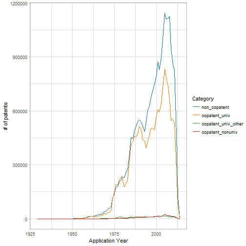

patent_final_agg
========================================================
author: 
date: 
autosize: true


First Slide
========================================================


```r
ggplot(d_agg %>% dplyr::filter(!(str_detect(type,"wcite$|cite$|total_patent")))) +
         geom_line(aes(appyear, sum, colour = reorder(type, -sum)), stat = "identity") +
  ylab("# of patents") +
  xlab("Application Year") +
  theme_light() +
  ggthemes::scale_colour_tableau(guide = guide_legend(title = "Category"))
```



- Bullet 1
- Bullet 2
- Bullet 3

Slide With Code
========================================================


```r
summary(cars)
```

```
     speed           dist       
 Min.   : 4.0   Min.   :  2.00  
 1st Qu.:12.0   1st Qu.: 26.00  
 Median :15.0   Median : 36.00  
 Mean   :15.4   Mean   : 42.98  
 3rd Qu.:19.0   3rd Qu.: 56.00  
 Max.   :25.0   Max.   :120.00  
```

Slide With Plot
========================================================


